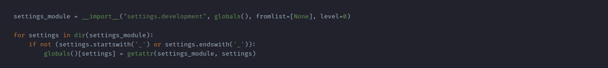
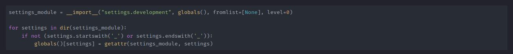
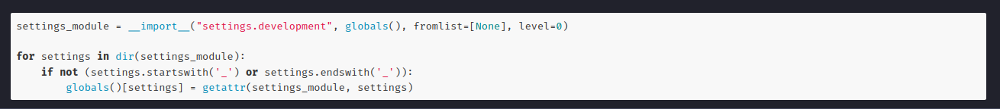

# Custom Highlight

---

## Changing the highlight

```yml
theme:
  highlight_js: highlight.min.js
  highlight_css: atom-one-dark.min.css
```

## Examples

- **Default**



- **Atom One Dark** `atom-one-dark.min.css`



- **Github** `github.min.css`


